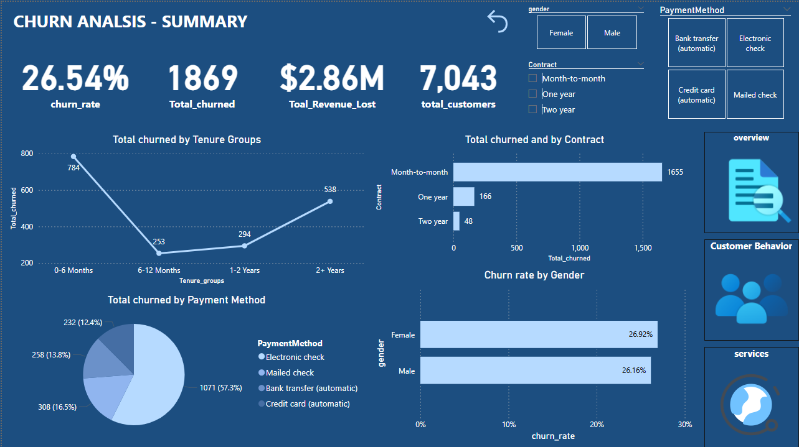
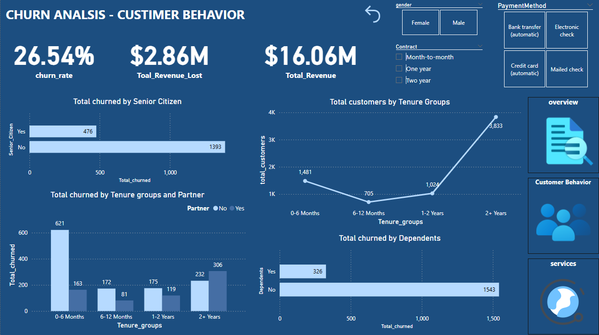
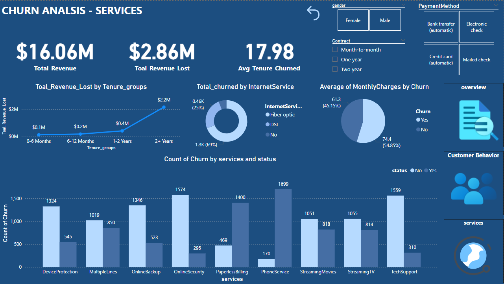

# Customer Churn Analysis

## Overview
This project is a **Power BI Report** designed to analyze customer churn in a telecom company. It provides insights into churn rates, revenue impact, customer segmentation, and service usage trends.

## Key Insights
- **Churn Rate:** **26.54%** – A critical metric showing customer retention challenges.  
- **Total Revenue Lost:** **$2.86M** – The financial loss due to customer churn.  
- **Total Customers:** **7,043** – The total active customer base.  
- **Contract Types & Churn:** Customers on **month-to-month contracts** have the highest churn rate (**88.6% of total churned customers**).  
- **Payment Method & Churn:** **Electronic check** users have the highest churn percentage (**57.3%**).  
- **Tenure & Churn:** Customers in their **first 6 months** have the highest churn rate.  
- **Senior Citizens & Churn:** Senior citizens show lower churn rates compared to non-senior citizens.  
- **Service Impact on Churn:** Lack of **tech support, online security, and device protection** correlates with higher churn.  

---

## Features
- **Churn Summary**: Key metrics including churn rate, total churned customers, and revenue loss.
- **Customer Behavior**: Analysis of churn by seniority, tenure, and partner/dependent status.
- **Service Analysis**: Insights into churn by internet service type, monthly charges, and additional services.

## Dashboard Screenshots
### Churn Summary

### Customer Behavior

### Service Analysis

---

##  Technology Stack  
- **Power BI** – Data visualization and dashboard development.
- **Excel** (for initial data cleaning and transformation).

## Dataset
The dataset used is **Telco Customer Churn**, containing customer information such as demographics, contract details, and service usage.

## Documentation 
[Documentation](Reports/Ojectives.docx)

---

### If you find this project useful, don’t forget to give it a star! ⭐ 

##  Let's Connect!

Email: eng.fayez66@gmail.com
  
 
  
